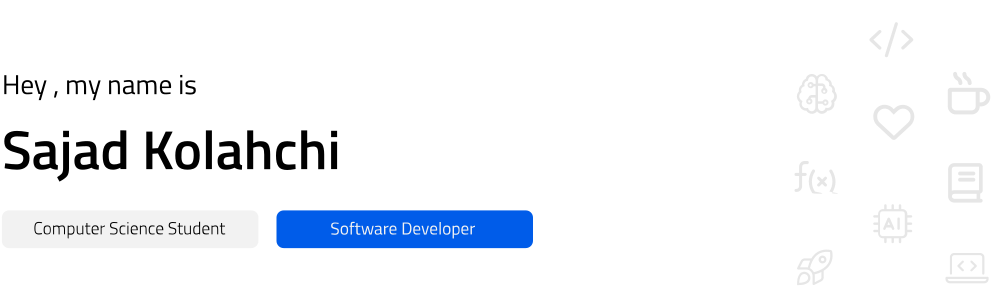

🧠 I’m currently learning **Machine Learning , Deep Learning , C++ & Python**

🤓 I’m looking to collaborate on **Software &#x2229; ML/DL open source projects**

💬 Ask me about **ML/DL , C++ , Python , Computer Science in general 🙂**

📫 How to reach me : **sajad.kolahchi@gmail.com**

📄 CV/Resume : <a href="https://sajadko.github.io/" target="_blank">**SajadKo.github.io**</a>

<h3>🛠️ Languages and Tools :</h3>

